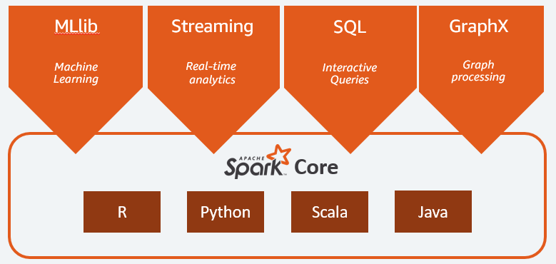

## Introdução!
Olá, bem vindo ao meu projeto sobre PySpark! Sempre quando começo estudar algo novo gosto muito de anotar coisas importantes e ir praticando, pois não há maneira melhor de fixar algo se não dessa forma. Durante os cursos que fiz e conteúdos que busquei na internet, fui praticando em um notebook do Google Colab e decidi trazê-lo para cá, ele possui exemplos hands-on de diversas coisa que se pode fazer com essa maravilhosa ferramenta! Abaixo deixo uma breve explicação sobre a ferramenta e sua utilização com Python. No final deixarei uma parte de links úteis e recomendações, onde também disponibilizo os arquivos utilizados nos exemplos práticos. 

## O que é Apache Spark?

O Apache Spark é um framework de código aberto projetado para processamento de dados em larga escala e computação distribuída. Como sua interface para programar clusters com paralelismo e tolerância a falha, ele fornece uma aplicação eficiente para análise de big data, aprendizado de máquina, processamento em tempo real e muito mais. Com seus recursos como processamento em memória e otimizações avançadas, o Spark permite o processamento de grandes conjuntos de dados de forma rápida e eficiente com APIs em Java, Scala, Python e R. Foi originalmente desenvolvido na Universidade da Califórnia, a base de código do projeto Spark posteriormente foi doada à Apache Software Foundation, que a mantém desde então.

## Características:
- **Processamento em memória:** O Spark pode armazenar dados em memória, o que permite um processamento significativamente mais rápido em comparação com os sistemas tradicionais de processamento de dados em disco, como o Hadoop MapReduce.

- **Escalabilidade horizontal:** Projetado para escalabilidade horizontal, o que significa que ele pode lidar com conjuntos de dados cada vez maiores ao adicionar mais nós a um cluster. Isso permite que o Spark atenda a demandas crescentes de processamento à medida que os dados aumentam.

- **Suporte a várias fontes de dados:** Com ele é possível ler e gravar dados de diversas fontes, como Hadoop Distributed File System (HDFS), Apache Cassandra, sistemas de arquivos locais e muito mais. Flexibilidade a qual torna-o compatível com diferentes tipos de armazenamento de dados.

- **Lazy evaluation:** Estratégia de processamento que adia a execução de operações de transformação em um conjunto de dados até que seja estritamente necessário. Em vez de executar imediatamente as transformações quando são definidas, o Spark cria um plano de execução chamado grafo acíclico dirigido (DAG) para representar a sequência de transformações aplicadas aos dados. Essa abordagem permite que o Spark otimize o processamento, evitando cálculos desnecessários e minimizando a movimentação de dados entre os nós do cluster.

## Componentes:

- **Spark Core:** É o coração do Spark e fornece as funcionalidades fundamentais do framework. Ele inclui a abstração de dados RDD (Resilient Distributed Dataset), que é a base para a computação distribuída no Spark, também gerencia o planejamento e a execução das tarefas em um cluster.

- **MLlib (Machine Learning Library):** Biblioteca de aprendizado de máquina que fornece algoritmos e ferramentas para tarefas de mineração de dados e análise preditiva. Com ele é possível realizar tarefas de classificação, regressão, agrupamento, entre outras.

- **Spark Streaming:** Processamento de dados em tempo real no Spark. Ele permite que você receba, processe e analise fluxos contínuos de dados em tempo real. O Spark Streaming também pode processar dados em lote, tornando-o uma escolha versátil para aplicativos de streaming e processamento de dados em lote.

- **Spark SQL:** Módulo que permite a integração do Spark com SQL, permitindo que os desenvolvedores realizem consultas SQL-like em seus dados, tanto em RDDs quanto em DataFrames.

- **GraphX:** Permite processamento gráfico (DAG). Não permite plotar gráficos, mas sim criar operações com gráficos, com seus nós e arestas, e ir realizando operações.

## Arquitetura do Spark

Spark funciona em uma arquitetura de modelo distribuído ou mestre-escravo, onde o mestre é chamado de "driver" e os escravos denominados como "worker nodes". 

O nó mestre é o ponto central do cluster e se encarga de coordenar a execução das tarefas, dividindo o trabalho em unidades menores e repasssar aos nós escravos. A primeira tarefa do driver é criar um o SparkContext, que é o ponto de entrada para a aplicação interagir com o cluster e utilizar os recursos do Spark.

Já os nós escravos são computadores individuais que compõem o cluster, eles executam as tarefas atribuidas e devolvem para o driver. 

- **Task:** Uma unidade de trabalho que será enviada para um executor.
- **Job:** Consiste em várias tarefas que são geradas em resposta a uma ação do Spark, podem ser observados no logs do driver. 

## Tipos de cluster manager
Atualmente o Spark tem compatibilidade com os seguintes administradores de cluster:

- **Stand-alone:** Gerenciador embutido no próprio Spark, permitindo que ele seja executado sem a necessidade de um gerenciador externo. É adequado para implantações menores e pode ser fácil de configurar, mas por outro lado possui menos recusos de escalabilidade que outras opções.

- **Apache Hadoop Yarn:** O gerenciador de recursos no Hadoop 2 e 3. Neste cluster, mestres e escravos estão altamente disponíveis para uso, sendo altamente escalável e pode suportar clusters com milhares de nós.

- **Apache Mesos:** O mesos tem uma arquitetura descentralizada, o mestre só é responsável pela tomada de decisões e alocação de recursos, enquanto os workers se encargam pelos recursos de computação.  

- **Kubernets:** Sistema open source que se utiliza para automatizar a implementação, o escalonamento e a gestão de aplicativos conteinerizados.

## PYSPARK

PySpark é uma das APIs que o Spark fornece para que os desenvolvedores interajam com a plataforma de acordo com a sua linguaguem preferida.

É uma escolha muito popular entre os engenheiros e cientistas de dados, para poder trabalhar tirando proveito da flexibilidade da linguaguem Python.

## Ações x Transformações

As ações (actions) e as transformações (transformations) são dois tipos principais de operações que podem ser aplicadas a um Resilient Distributed Dataset (RDD). RDD é a abstração básica de dados no Spark, que representa uma coleção imutável e particionada de registros que podem ser processados em paralelo em um cluster. Vamos entender a diferença entre ação e transformação!

- **Transformação:** São operações que geram um novo RDD a partir de um RDD existente, de modo geral aplicando alguma forma mapeamento, filtragem ou agregação nos dados. Os RDDs resultantes das transformações são preguiçosos (vamos recordar do conceito de lazy evaluation), isso significa que a transformação não é executada de forma imediata, e somente quando é chamado uma ação.

- **Ação:** As ações são operações que retornam um valor final ao programa ou que gravam dados em um armazenamento, as ações desencadeiam a execução de todas as transformações anteriores no RDD, uma vez que elas precisam trasformar os dados para obter o resultado, ponto onde a computação 'real' acontece, e isso é feito atráves do plano lógico que o Spark cria.  

## Links úteis

[Site oficial do Apache Spark](https://spark.apache.org/)

[SparkByExamples - Ótimo site para tutoriais](https://sparkbyexamples.com/)

[Artigo do Medium, introdução ao Spark](https://medium.com/gabriel-luz/spark-101-introdu%C3%A7%C3%A3o-ao-framework-de-processamento-de-dados-distribu%C3%ADdos-1f959e596024)

[Arquivos usados no Colab](https://drive.google.com/drive/folders/1-RiB0X7Kzpyik9Vt9ws7TSl1yGjFiLzh)

Para finalizar, gostaria de recomendar o livro Learning Spark da O'Reilly! E deixo meus agradecimentos por ter reservado um tempo e ter chegado até aqui!

